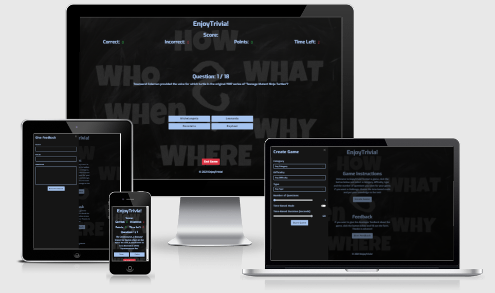
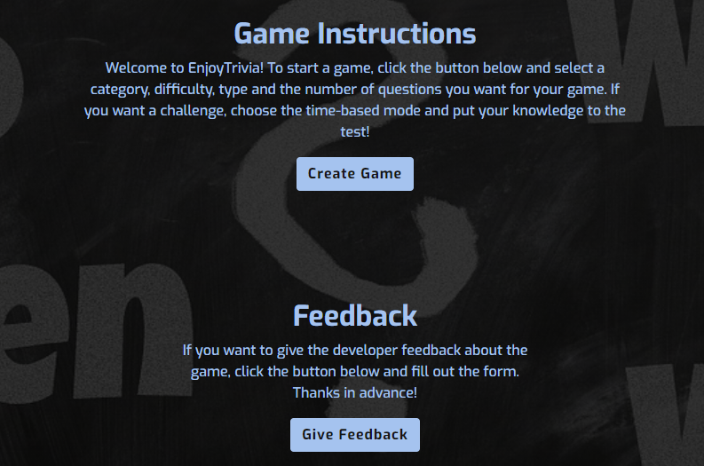
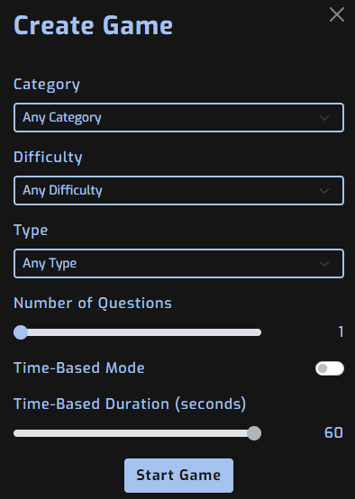
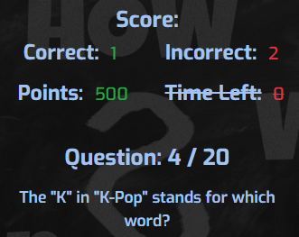
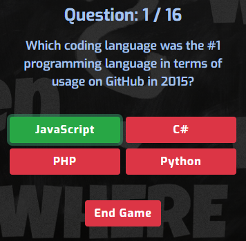
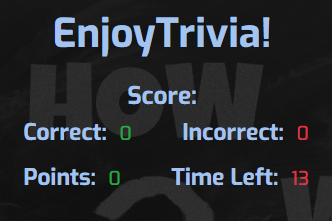
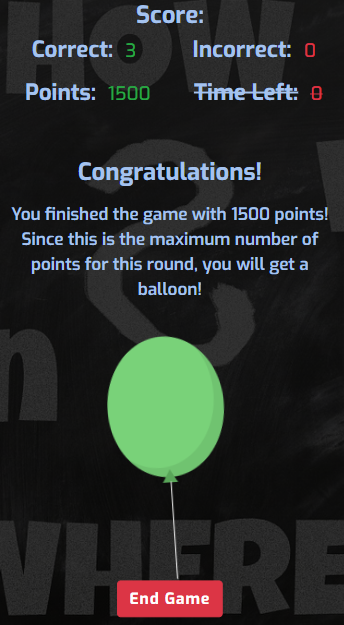
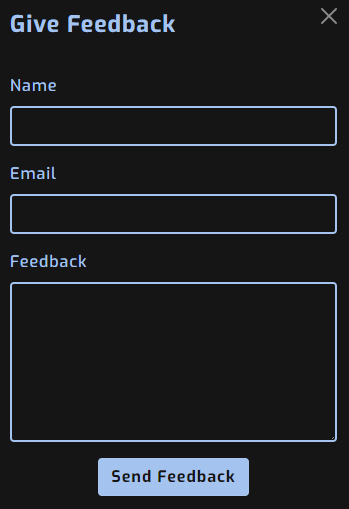

# EnjoyTrivia!



[EnjoyTrivia!](https://mangez84.github.io/enjoytrivia/) is a game for anyone who is curious and not afraid of a challenge. 

If you want to prove your knowledge, select the desired category, difficulty and number of questions and start playing!

Let the [fun](https://mangez84.github.io/enjoytrivia/) begin!

## Table of Contents

1. [UX](#ux)
    - [User Stories](#user-stories)
        - [New Player Goals](#new-player-goals)
        - [Frequent Player Goals](#frequent-player-goals)
    - [Developer Goals](#developer-goals)
    - [Design](#design)
        - [Inspiration](#inspiration)
        - [Background](#background)
        - [Colours](#colours)
        - [Fonts](#fonts)
    - [Wireframes](#wireframes)
2. [Features](#features)
    - [Existing Features](#existing-features)
    - [Features Left to Implement](#features-left-to-implement)
3. [Technologies Used](#technologies-used)
    - [Languages Used](#languages-used)
    - [Frameworks, Libraries and Software Used](#frameworks-libraries-and-software-used)
4. [Test](#test)
    - [Validation Services](TEST.md#validation-services)
        - [W3C Markup Validation Service](TEST.md#w3c-markup-validation-service)
        - [W3C CSS Validation Service](TEST.md#w3c-css-validation-service)
        - [JSHint](TEST.md#jshint)
    - [Testing User Stories For New Players](TEST.md#testing-user-stories-for-new-players)
    - [Testing User Stories For Frequent Players](TEST.md#testing-user-stories-for-frequent-players)
    - [Further Testing](TEST.md#further-testing)
    - [Known Bugs](TEST.md#known-bugs)
        - [Fixed](TEST.md#fixed)
        - [Unfixed](TEST.md#unfixed)
5. [Deployment](#deployment)
6. [Credits](#credits)
    - [Code](#code)
    - [Content](#content)
    - [Media](#media)
        - [Images](#images)
    - [Acknowledgments](#acknowledgments)

## UX

### User Stories

#### New Player Goals

- As a new player, I want to be able to get questions from a specific category.
- As a new player, I want to be able to choose the level of difficulty.
- As a new player, I want to be able to choose the number of questions.
- As a new player, I want to see a scoreboard that shows the number of correct and incorrect answers.
- As a new player, I want the option to end the game and start over.
- As a new player, I want to be able to play the game on my computer, tablet and smartphone.
- As a new player, I want to be celebrated if I answer all the questions correctly.
- As a new player, I want to clearly see the question and the choices available for answers.
- As a new player, I want the correct answer to be displayed even if I answer incorrectly.

#### Frequent Player Goals

- As a frequent player, I want to be able to increase the difficulty further with configurable time limits for the questions.
- As a frequent player, I want to be able to contact the developer of the game and give feedback.
- As a frequent player, I want to be able to start a game quickly.
- As a frequent player, I do not want to get questions that I have already had.

### Developer Goals

- Strengthen my skills in HTML5, CSS and JavaScript.
- Create a well-structured website with good error handling and clear feedback to users.
- Have fun working with APIs.
- Create a good gaming experience that is also a source of knowledge.

### Design

#### Inspiration

- Inspiration for the game mechanics and some of the design choices come from the Swedish game [Quizkampen](http://www.quizkampen.se/). Try it out! :)

#### Background

- The background was chosen for its clear connection to questions and the search for knowledge. With CSS styling, the background becomes darker to make the text content clearly visible.

#### Colours

- The blue colour was chosen as the combination with the dark background gives a nice impression. Green and red are used to highlight correct and incorrect answers and also fit the dark background well.

#### Fonts

- The Exo font was chosen because it gives a playful impression and thus fits well for a game. The font is easy to read and is used for both headings and other text content in the web application.

### Wireframes

- [Index Page](assets/wireframes/index.pdf)
- [Give Feedback](assets/wireframes/givefeedback.pdf)
- [Create Game](assets/wireframes/creategame.pdf)
- [Play Game](assets/wireframes/playgame.pdf)
- [Victory](assets/wireframes/victory.pdf)

## Features

### Existing Features

- Clear navigation which makes it easy to start a game.

    

- Options are available to configure the game with the desired category, difficulty and number of questions.
- The type option can be used to select multiple choice questions or true or false questions.

    
    
- A scoreboard that shows the number of correct and incorrect answers.

    

- Good visual feedback when a question is answered correctly or incorrectly.
- A source of knowledge because the correct answer is highlighted if the player should answer incorrectly.

    

- A time-based mode that further challenges the player.

    

    

- If all questions are answered correctly, the player is rewarded with a celebration.

    

- It is possible to send feedback to the developer using a form.

    

- The game can be played on computers, tablets and smartphones.

### Features Left to Implement

*Due to time constraints, the following feature will not be implemented until the next version of the web application is released.*

- A feature that ensures that the player does not get the same question twice. 
    - This can be solved by retrieving a session token from the API. As long as there are questions left in the database that have not been returned, the session token ensures that you never get the same question twice.

## Technologies Used

### Languages Used

- [HTML5](https://en.wikipedia.org/wiki/HTML5)
- [CSS3](https://en.wikipedia.org/wiki/CSS)
- [JavaScript](https://en.wikipedia.org/wiki/JavaScript)

### Frameworks, Libraries, APIs and Software Used

- [Bootstrap 5.0](https://getbootstrap.com/docs/5.0/getting-started/introduction/)
    - The project uses the grid system, flex utilities, the offcanvas component and forms from the Bootstrap 5.0 framework.
- [jQuery](https://jquery.com/)
    - jQuery is used as a complement to standard JavaScript for DOM selection and manipulation.
- [Open Trivia Database](https://opentdb.com/)
    - The game is built around the [Open Trivia Database API](https://opentdb.com/api_config.php). All categories, questions and answers are retrieved from this API. The API is free to use for developers and is well documented.
- [EmailJS](https://www.emailjs.com/)
    - The EmailJS SDK is used to send feedback to the developer via email. The SDK is easy to use and enables a secure way to send email with JavaScript.
- [Git](https://git-scm.com/)
    - Git is used to keep track of changes in the project code.
- [Github](https://github.com/)
    - The code is stored in Github and the web application is hosted on GitHub Pages.
- [Gitpod](https://gitpod.io/)
    - Gitpod was used as a development environment throughout the project.
- [Balsamiq](https://balsamiq.com/)
    - Wireframes for the project were created with Balsamiq.
- [Google Fonts](https://fonts.google.com/)
    - The Exo font used in the project is imported from Google Fonts.
- [favicon.io](https://favicon.io/)
    - The favicon used on the website was generated on [favicon.io](https://favicon.io/).
- [WebAIM](https://webaim.org/resources/contrastchecker/)
    - This tool was used to check the contrast ratio between the background and the text content.

## Test

- See separate file [TEST.md](TEST.md) for information on completed tests and results from these.

## Deployment

### Github Pages

EnjoyTrivia! was deployed to GitHub Pages using the following procedure.

- Log into [GitHub](https://github.com/) and click on the [repository](https://github.com/mangez84/enjoytrivia) named **enjoytrivia**.
- Click on the **Settings** button in the repository navigation bar.
- Scroll down and click on the **Pages** link to the left.
- Under **Source** click the button named **None** and choose **master** in the dropdown menu.
- Click the **Save** button.
- A [link](https://mangez84.github.io/enjoytrivia/) to the published site is displayed.

### Fork the GitHub Repository

To make a **fork** of this repository to your own account use the following procedure.

- Log into your [GitHub](https://github.com/) account and browse to [this repository](https://github.com/mangez84/enjoytrivia).
- Locate the **Fork** button in the upper right corner and click it.
- You should now have a copy of the repository in your own account.

### Clone the GitHub Repository

To make a **clone** of this repository use the following procedure.

- Log into your [GitHub](https://github.com/) account and browse to the [repository](https://github.com/mangez84/enjoytrivia).
- Locate the **Code** button and click it.
- Choose **Download ZIP** from the dropdown menu to download the project as a compressed file or copy the **HTTPS** link.
- If you copied the HTTPS link open a terminal with access to [`git`](https://git-scm.com/).
- Navigate to or create a desired working directory for the project.
- Type **git clone** followed by the HTTPS link you copied.

    ```
    git clone https://github.com/mangez84/enjoytrivia
    ```
- Press Enter and a local clone will be created in your current working directory.

## Credits

### Code

- Code to obtain API data using the fetch() method was copied from this [JavaScript Tutorial](https://www.javascripttutorial.net/javascript-fetch-api/) post. This post also has good descriptions on how to handle asynchronous HTTP requests reliably.
- This [Stack Overflow](https://stackoverflow.com/questions/169506/obtain-form-input-fields-using-jquery/1443005#1443005) post had a good tip about the .serialize() function in jQuery. Code was copied into the project and then modified.
- The function to shuffle an array was copied in its entirety from this [Stack Overflow](https://stackoverflow.com/questions/6274339/how-can-i-shuffle-an-array/6274381#6274381) post.
- The code for darkening the background image came from this [CSS-Tricks](https://css-tricks.com/design-considerations-text-images/) post.
- The function for decoding HTML entities was copied from this [Stack Overflow](https://stackoverflow.com/questions/7394748/whats-the-right-way-to-decode-a-string-that-has-special-html-entities-in-it/7394787#7394787) post.
- The code for changing the colour of the range slider was found in this [Stack Overflow](https://stackoverflow.com/a/56424165) post.
- The code for solving the bug with multiple correct answers was copied from this [jQuery Forum](https://forum.jquery.com/topic/contains-but-i-want-exact-how) post.
- The code showing the balloon when the player reaches the maximum number of points was copied from [Bennett Feely on codepen.io](https://codepen.io/bennettfeely/pen/nbFCp).
- Valuable information about overflowing text and how to solve it was found in this [MDN Web Docs](https://developer.mozilla.org/en-US/docs/Web/CSS/overflow-wrap) article.
- The code for resetting a form after submit was copied from this [Stack Overflow](https://stackoverflow.com/a/8701877) post.

### Content

- A large part of the text content is retrieved from the Open Trivia Database API. The JSON response is used to populate the game with questions and answer options. All other text content has been written by the developer.

### Media

#### Images

- The background image was obtained from [Gerd Altmann on Pixabay](https://pixabay.com/illustrations/board-questions-who-what-how-why-776688/).

### Acknowledgments

- My wife who has supported and advised me during the project.
- My stepdaughter who is the only one in the family who owns an iPhone and who has contributed with valuable tests on this device.
- My Code Institute mentor Gerard McBride for helpful and encouraging mentor sessions.