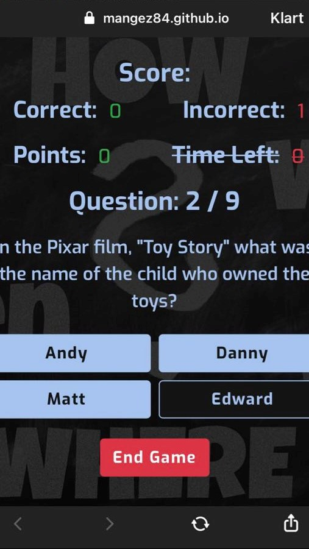

# Enjoy Trivia!

## Table of Contents

1. [Test](#test)
    - [Validation Services](#validation-services)
        - [W3C Markup Validation Service](#w3c-markup-validation-service)
        - [W3C CSS Validation Service](#w3c-css-validation-service)
        - [JSHint](#jshint)
    - [Testing User Stories For New Players](#testing-user-stories-for-new-players)
    - [Testing User Stories For Frequent Players](#testing-user-stories-for-frequent-players)
    - [Further Testing](#further-testing)
    - [Known Bugs](#known-bugs)
        - [Solved](#solved)
        - [Unsolved](#unsolved)

## Test

### Validation Services

#### [W3C Markup Validation Service](https://validator.w3.org/)

- [Index Page](https://validator.w3.org/nu/?doc=https%3A%2F%2Fmangez84.github.io%2Fenjoytrivia%2F)
- HTML generated by JavaScript was validated by direct input and gave no warnings or errors.

#### [W3C CSS Validation Service](https://jigsaw.w3.org/css-validator/)

- The [CSS](assets/css/style.css) code was validated by direct input.
- Apart from warnings regarding vendor-specific extensions and external stylesheets, the validation reported no errors or warnings.
- The vendor-specific extensions are used to control the colour of the range slider and switch button. CSS from Bootstrap is used widely in the project. 

#### [JSHint](https://jshint.com/)

- [Game](assets/js/enjoytrivia-game.js)
    - The code for the game was validated by pasting the contents of the JavaScript file into JSHint.
    - The validation tool did not report any warnings or errors.
    - JSHint was configured with the following comments.
        ```
        /* jshint esversion: 8 */ 
        /* globals $:false */
        ```
- [Feedback](assets/js/enjoytrivia-feedback.js)
    - The feedback function was validated by pasting the contents of the JavaScript file into JSHint.
    - The validation tool did not report any warnings or errors.
    - JSHint was configured with the following comments.
        ```
        /* jshint esversion: 8 */ 
        /* global emailjs */
        ```

### Testing User Stories For New Players

### Testing User Stories For Frequent Players

### Further Testing

### Known Bugs

#### Solved

- Some questions returned from the OpenTriviaDB API contain [HTML entities](https://www.w3schools.com/html/html_entities.asp) but these are decoded if the string is presented in the DOM. The variable used for the correct answer is not presented in the DOM, which resulted in that the comparison between the correct and submitted answer sometimes failed. This was fixed using a function that decodes the HTML entities in the string containing the correct answer.
- The jQuery [:contains()](https://api.jquery.com/contains-selector/) selector used to mark the correct answer sometimes marked several answers as correct. This could happen if the correct answer is a substring of an incorrect answer. The bug was solved with the help of this [jQuery Forum](https://forum.jquery.com/topic/contains-but-i-want-exact-how) post.

#### Unsolved

- The game does not work at all in IE11.
- Some questions with very long content may grow into the button next to it.
- On iPhone with the Safari browser, one of the answer buttons is in a hovered state even if the player is idle. I have not been able to reproduce this since I do not own an iPhone. 

Back to the [README.md](README.md) file.