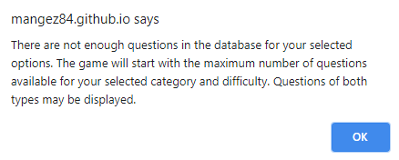
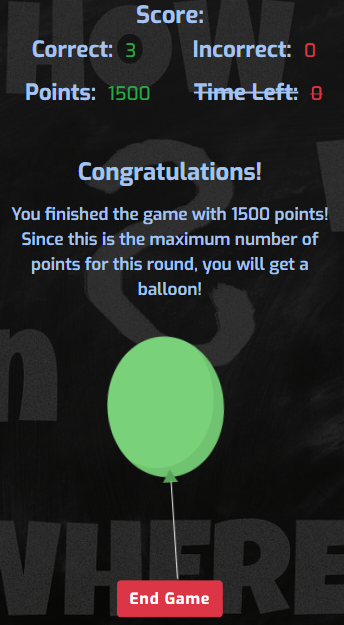
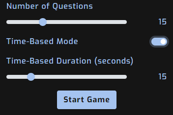

# Enjoy Trivia!

## Table of Contents

1. [Test](#test)
    - [Validation Services](#validation-services)
        - [W3C Markup Validation Service](#w3c-markup-validation-service)
        - [W3C CSS Validation Service](#w3c-css-validation-service)
        - [JSHint](#jshint)
    - [Testing User Stories For New Players](#testing-user-stories-for-new-players)
    - [Testing User Stories For Frequent Players](#testing-user-stories-for-frequent-players)
    - [Further Testing](#further-testing)
    - [Known Bugs](#known-bugs)
        - [Fixed](#fixed)
        - [Unfixed](#unfixed)

## Test

### Validation Services

#### [W3C Markup Validation Service](https://validator.w3.org/)

- [Index Page](https://validator.w3.org/nu/?doc=https%3A%2F%2Fmangez84.github.io%2Fenjoytrivia%2F)
- HTML generated by JavaScript was validated by direct input and gave no warnings or errors.

#### [W3C CSS Validation Service](https://jigsaw.w3.org/css-validator/)

- The [CSS](assets/css/style.css) code was validated by direct input.
- Apart from warnings regarding vendor-specific extensions and external stylesheets, the validation reported no errors or warnings.
- The vendor-specific extensions are used to control the colour of the range slider and switch button. CSS from Bootstrap is used widely in the project. 

#### [JSHint](https://jshint.com/)

- [Game](assets/js/enjoytrivia-game.js)
    - The code for the game was validated by pasting the contents of the JavaScript file into JSHint.
    - The validation tool did not report any warnings or errors.
    - JSHint was configured with the following comments.

        ```
        /* jshint esversion: 8 */ 
        /* globals $:false */
        ```
- [Feedback](assets/js/enjoytrivia-feedback.js)
    - The feedback function was validated by pasting the contents of the JavaScript file into JSHint.
    - The validation tool did not report any warnings or errors.
    - JSHint was configured with the following comments.

        ```
        /* jshint esversion: 8 */ 
        /* global emailjs */
        ```

### Testing User Stories For New Players

- As a new player, I want to be able to get questions from a specific category.
    - The form for creating a game clearly shows where you can select a category.
    - There are 24 categories to choose from or you can get questions from any category.

    

- As a new player, I want to be able to choose the level of difficulty.
    - The form for creating a game clearly shows where you can select the difficulty.
    - Easy, medium or hard questions can be selected when creating the game.

    

- As a new player, I want to be able to choose the number of questions.
    - The form for creating a game clearly shows where you can select the number of questions.
    - If there are not enough questions available for the selected options, information is displayed to the player.

    

    

- As a new player, I want to see a scoreboard that shows the number of correct and incorrect answers.
    - When the game is created, the scoreboard is displayed at the top of the page.
    - The values for the number of correct and incorrect answers are marked in green and red.

    

- As a new player, I want the option to end the game and start over.
    - A button to end the game is located at the bottom of the page.

    

- As a new player, I want to be able to play the game on my computer, tablet and smartphone.
    - The game has been tested on a number of different devices and is nice to play regardless of which device is used.

- As a new player, I want to be celebrated if I answer all the questions correctly.
    - If the player answers all the questions correctly, a nice balloon is displayed.

    

- As a new player, I want to clearly see the question and the choices available for answers.
    - Along with the question, answer options are clearly visible in the middle of the page.

    

- As a new player, I want the correct answer to be displayed even if I answer incorrectly.
    - The game is educational and shows the correct answer even if the player answers incorrectly.

    

### Testing User Stories For Frequent Players

- As a frequent player, I want to be able to increase the difficulty further with configurable time limits for the questions.
    - The time-based mode can be activated in the form and the player has the opportunity to configure the time limit before an answer must be given.
    - The time left is displayed in the scoreboard.

    

    

- As a frequent player, I want to be able to contact the developer of the game and give feedback.
    - On the index page, the player can choose to give feedback to the developer. 
    - A form can be filled out to send an email to the game creator.

    

    

- As a frequent player, I want to be able to start a game quickly.
    - The index page is designed to give players a quick option to get to the form where you create the game.
    - The button to create a game is clearly visible when you enter the page.

    

- As a frequent player, I do not want to get questions that I have already had.
    - Unable to test this user story as the feature is not implemented. See [Features Left to Implement](README.md#features-left-to-implement) for more information.

### Further Testing

- The web application has been tested on Google Chrome, Mozilla Firefox and Microsoft Edge by the developer. The tests show that the web application looks and behaves similarly on these browsers.
- Internet Explorer 11 has also been tested. Read more under [Known Bugs - Unfixed](#unfixed).
- Tests have been done on an iPhone 8 device with the Safari browser. Read more under [Known Bugs - Unfixed](#unfixed).
- [Chrome DevTools](https://developer.chrome.com/docs/devtools/) has been used for testing and debugging purposes.
- Throughout the development work, the responsiveness of the web application was tested continuously.
- Tests have also been done on the deployed version available on GitHub Pages.

### Known Bugs

#### Fixed

- Some questions returned from the OpenTriviaDB API contain [HTML entities](https://www.w3schools.com/html/html_entities.asp) but these are decoded if the string is presented in the DOM. The variable used for the correct answer is not presented in the DOM, which resulted in that the comparison between the correct and submitted answer sometimes failed. This was fixed using a function that decodes the HTML entities in the string containing the correct answer.
- The jQuery [:contains()](https://api.jquery.com/contains-selector/) selector used to mark the correct answer sometimes marked several answers as correct. This could happen if the correct answer is a substring of an incorrect answer. The bug was solved with the help of this [jQuery Forum](https://forum.jquery.com/topic/contains-but-i-want-exact-how) post.
- Some questions and answers have single words that are very long and can cause the content to overflow. [Google](https://google.com) and [MDN Web Docs](https://developer.mozilla.org/en-US/docs/Web/CSS/overflow-wrap) helped me solve this issue.

#### Unfixed

- The two columns for the answer buttons can vary in size depending on the content. This may look strange in some cases.
- The game does not work at all in IE11. This will however not be a priority when the next version of the web application is developed.
- On iPhone with the Safari browser, one of the answer buttons is in a hovered state even if the player is idle. I have not been able to reproduce this since I do not own an iPhone.

    

Back to the [README.md](README.md#test) file.